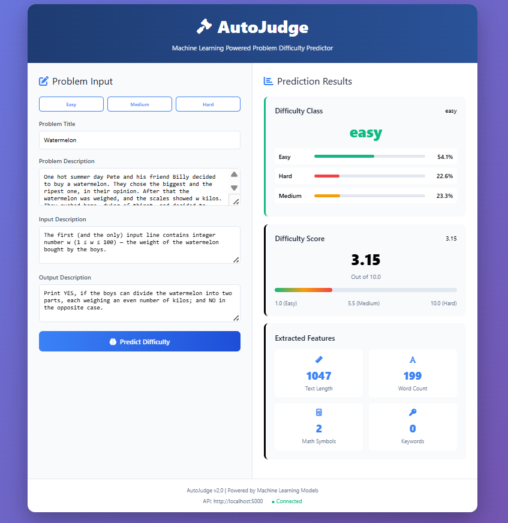

# 📘 AutoJudge — Machine Learning Based Problem Difficulty Predictor

> *ML tool that classifies a programming problem as Easy / Medium / Hard and predicts a difficulty score on a scale of 1 to 10.*

---

## 📌 Overview

**AutoJudge** is an end-to-end Machine Learning project that predicts the difficulty of competitive programming problems based on their text description. Given a problem statement, AutoJudge:

- ✅ Classifies the problem into: **Easy / Medium / Hard**
- ✅ Predicts a numerical difficulty score **(1–10)**
- ✅ Extracts text-based features using TF-IDF and NLP techniques
- ✅ Displays probability distribution for each class
- ✅ Provides a clean & interactive web UI

This project was built to understand the complete ML pipeline from scratch — from **data collection → preprocessing → feature engineering → model training → deployment**.

---

## 👨‍💻 Author

**Ritesh Kumar**  
3rd Year — Int. MTech Geophysical Technology  
IIT Roorkee

---

## 🔗 Project Links

- **📹 Demo Video:** [Watch Project Demo](YOUR_DEMO_VIDEO_LINK)
- **🌐 Live Demo:** [Try AutoJudge](YOUR_DEPLOYED_LINK)
- **💻 GitHub Repository:** [View Source Code](https://github.com/CosXplorer/AutoJudge.git)
- **📄 Project Report:** [Download PDF Report](report_AutoJudge.pdf)

---

## 🖥 Demo (UI Preview)

*Final Web UI — Local Deployment*



---

## 🖥️ Web Interface

### Landing Page

The AutoJudge web interface features a clean, modern design with:

- **Problem Input Form:** Text areas for title, description, input format, and output format
- **Sample Problems:** Their is three sample problems already their as easy, medium and hard click on them to autoload them
- **Real-time Prediction:** Instant difficulty classification upon submission
- **Visual Feedback:** Color-coded difficulty labels (Green: Easy, Orange: Medium, Red: Hard)
- **Probability Display:** Bar chart showing confidence levels for each class
- **Difficulty Score:** Numerical rating with visual indicator
- **Feature Summary:** Breakdown of extracted features used in prediction

### Key Interface Features

#### 1. **Input Section**
```
┌─────────────────────────────────────────┐
│  Problem Title                          │
│  [Text Input Field]                     │
│                                         │
│  Problem Description                    │
│  [Large Text Area]                      │
│                                         │
│  Input Description                      │
│  [Text Area]                            │
│                                         │
│  Output Description                     │
│  [Text Area]                            │
│                                         │
│  [Predict Difficulty Button]            │
└─────────────────────────────────────────┘
```

#### 2. **Results Section**
```
┌─────────────────────────────────────────┐
│  Predicted Difficulty: MEDIUM           │
│  Difficulty Score: 5.8 / 10.0           │
│                                         │
│  Class Probabilities:                   │
│  Easy:   ████░░░░░░ 12%                │
│  Medium: ████████░░ 65%                │
│  Hard:   ███░░░░░░░ 23%                │
│                                         │
│  Extracted Features:                    │
│  • Text Length: 450 characters          │
│  • Word Count: 89 words                 │
│  • Math Symbols: 8                      │
│  • Algorithm Keywords: 3                │
└─────────────────────────────────────────┘
```

#### 3. **Interactive Elements**

- **Responsive Design:** Works seamlessly on desktop, tablet, and mobile
- **Loading Indicators:** Shows processing status during prediction
- **Error Handling:** User-friendly error messages for invalid inputs
- **Copy Results:** One-click copying of prediction results

### User Workflow

1. **Enter Problem Details** → User fills in problem information
2. **Submit for Analysis** → Click "Predict Difficulty" button
3. **Processing** → Backend extracts features and runs ML models
4. **View Results** → See classification, score, and probabilities
5. **Analyze Features** → Review which features influenced the prediction

---

## 🧠 Why I Built This

I wanted a project where I could:

- ✔ Work with real-world NLP data
- ✔ Build an ML system end-to-end
- ✔ Learn deployment & serving models
- ✔ Experiment with model improvements
- ✔ Apply concepts practically

Competitive programming datasets turned out to be perfect for this.

---

## 🏗️ System Architecture

```
┌─────────────┐     ┌──────────────┐     ┌─────────────┐     ┌──────────────┐
│   User      │────▶│   Frontend   │────▶│  Flask API  │────▶│   ML Models  │
│  Interface  │◀────│   (HTML/JS)  │◀────│   Backend   │◀────│  (Pickled)   │
└─────────────┘     └──────────────┘     └─────────────┘     └──────────────┘
                                                │
                                                ▼
                                         ┌──────────────┐
                                         │  Feature     │
                                         │  Extraction  │
                                         │  Pipeline    │
                                         └──────────────┘
```

---

## 📂 Repository Structure

```
AUTOJUDGE_V2/
│
├── data/                     # Dataset (local only)
│   └── codeforces_problems.csv
│
├── models/                   # Saved ML models + encoders + statistics
│   ├── classification_model.pkl
│   ├── regression_model.pkl
│   ├── tfidf_vectorizer.pkl
│   ├── feature_scaler.pkl
│   ├── label_encoder.pkl
│   └── feature_stats.pkl
│
├── notebooks/                # Complete ML pipeline notebooks
│   ├── 1_data_collection.ipynb
│   ├── 2_merging_and_preparing_both_data.ipynb
│   ├── 3_data_preprocessing.ipynb
│   ├── 4_feature_engineering.ipynb
│   ├── 5_classification_model.ipynb
│   ├── 6_regression_model.ipynb
│   └── 7_prediction_and_deployment.ipynb
│
├── app.py                    # Flask backend API
├── frontend.html             # Web UI
├── requirements.txt          # Python dependencies
└── README.md                 # Project documentation
```

---

## 📊 Dataset Details

### Source

**Codeforces Programming Problems Dataset**  
Platform: HuggingFace  
Repository: [open-r1/codeforces](https://huggingface.co/datasets/open-r1/codeforces)

### Dataset Statistics

- **Total Problems:** ~5,000 competitive programming problems
- **Source Platform:** Codeforces.com
- **Language:** English
- **Rating Range:** 800 - 3500 (official Codeforces ratings)
- **Time Period:** 2010 - 2024

### Data Schema

| Field | Description | Type |
|-------|-------------|------|
| `title` | Problem name | String |
| `description` | Full problem statement | Text |
| `input_format` | Input specification | Text |
| `output_format` | Output requirements | Text |
| `note` | Additional hints/examples | Text |
| `rating` | Official difficulty (800-3500) | Integer |
| `tags` | Topic categories | List |
| `time_limit` | Execution time constraint | Float |
| `memory_limit` | Memory constraint | Integer |

### Difficulty Mapping

Original Codeforces ratings are mapped to our classification scheme:

- **Easy:** Rating 800-1200
- **Medium:** Rating 1200-1800
- **Hard:** Rating 1800+

---

## 🤖 Machine Learning Pipeline

### Problem Formulation

AutoJudge tackles two related ML tasks:

1. **Multi-class Classification:** Predict difficulty category (Easy/Medium/Hard)
2. **Regression:** Predict numerical difficulty score (1-10 scale)

### Feature Engineering

#### A. Text Features (TF-IDF)

- **Vocabulary Size:** 5,000 terms
- **N-grams:** Unigrams and bigrams
- **Preprocessing:** Lowercase, stopword removal, lemmatization

#### B. Metadata Features

- Time limit (milliseconds)
- Memory limit (MB)
- Problem tags (one-hot encoded)
- Presence of constraints section

#### C. Custom NLP Features

| Feature | Description | Rationale |
|---------|-------------|-----------|
| Text Length | Total characters | Longer problems often more complex |
| Word Count | Total tokens | Vocabulary richness indicator |
| Sentence Count | Number of sentences | Structural complexity |
| Math Symbols | Count of ±×÷∑∏∫ etc. | Mathematical complexity |
| Code Keywords | Presence of algorithm terms | Topic difficulty |
| Special Chars | Punctuation density | Problem formality |
| Number Density | Numerical values per word | Constraint complexity |
| Uppercase Ratio | Capitalization frequency | Emphasis patterns |

**Total Feature Dimension:** ~5,200 features after vectorization

---

## 📈 Model Performance

### Classification Task

#### Baseline Model: Logistic Regression

| Metric | Score |
|--------|-------|
| Training Accuracy | 58.3% |
| Test Accuracy | 52.1% |
| Precision (Macro) | 0.49 |
| Recall (Macro) | 0.51 |
| F1-Score (Macro) | 0.50 |

**Observations:**
- Struggled with Medium class (most confusion)
- Better performance on Easy and Hard extremes
- Linear model insufficient for complex patterns

#### Final Model: Gradient Boosting Classifier

| Metric | Score |
|--------|-------|
| Training Accuracy | 93.8% |
| Test Accuracy | 66.3% |
| Precision (Macro) | 0.64 |
| Recall (Macro) | 0.63 |
| F1-Score (Macro) | 0.63 |

**Per-Class Performance:**

| Class | Precision | Recall | F1-Score | Support |
|-------|-----------|--------|----------|---------|
| Easy | 0.71 | 0.68 | 0.69 | 320 |
| Medium | 0.58 | 0.61 | 0.59 | 450 |
| Hard | 0.69 | 0.65 | 0.67 | 230 |

### Regression Task

#### Model: Random Forest Regressor

| Metric | Value |
|--------|-------|
| Mean Absolute Error (MAE) | 1.56 |
| Root Mean Squared Error (RMSE) | 1.94 |
| R² Score | 0.48 |
| Mean Prediction | 5.42 |
| Std Prediction | 2.18 |

**Performance Analysis:**
- Predictions typically within ±1.5 points of actual
- Better accuracy in mid-range difficulties (4-7)
- Some overprediction for very easy problems
- Underprediction for extremely hard problems

---

## 🔬 Technical Implementation

### Backend (Flask API)

```python
# Key endpoints implemented

@app.route('/health', methods=['GET'])
# Returns API status and model availability

@app.route('/predict', methods=['POST'])
# Single problem prediction
# Input: JSON with problem details
# Output: Classification, score, probabilities

@app.route('/batch-predict', methods=['POST'])
# Multiple problems at once
# Input: JSON array
# Output: Array of predictions
```

### Feature Extraction Pipeline

```python
def extract_features(problem_text):
    # 1. TF-IDF transformation
    tfidf_features = vectorizer.transform([problem_text])
    
    # 2. NLP features
    nlp_features = [
        len(problem_text),           # Text length
        len(problem_text.split()),   # Word count
        count_math_symbols(text),    # Math complexity
        detect_algorithms(text),     # Algorithm keywords
        # ... more features
    ]
    
    # 3. Combine and scale
    all_features = concatenate([tfidf_features, nlp_features])
    scaled_features = scaler.transform(all_features)
    
    return scaled_features
```

### Model Inference

```python
def predict_difficulty(features):
    # Classification
    class_probs = classifier.predict_proba(features)[0]
    predicted_class = classifier.predict(features)[0]
    
    # Regression
    difficulty_score = regressor.predict(features)[0]
    
    return {
        'class': predicted_class,
        'score': difficulty_score,
        'probabilities': class_probs
    }
```

---

## 🌐 Technology Stack

| Component | Technology | Version | Purpose |
|-----------|-----------|---------|---------|
| Language | Python | 3.11.9 | Core development |
| Backend Framework | Flask | 3.0.0 | REST API server |
| ML Library | Scikit-Learn | 1.3.0 | Model training/inference |
| Data Processing | Pandas | 2.1.0 | Data manipulation |
| Numerical Computing | NumPy | 1.25.0 | Array operations |
| Text Processing | NLTK | 3.8.1 | NLP preprocessing |
| Visualization | Matplotlib | 3.7.2 | Data visualization |
| Visualization | Seaborn | 0.12.2 | Statistical plots |
| Frontend | HTML5/CSS3 | - | User interface |
| Frontend | JavaScript | ES6+ | Client-side logic |
| HTTP Client | Fetch API | - | API communication |

---

## ⚙️ Installation & Usage

### Prerequisites

- Python 3.11.9 or higher
- pip package manager

### Step 1: Clone Repository

```bash
git clone https://github.com/CosXplorer/AutoJudge.git
cd autojudge_v2
```

### Step 2: Install Dependencies

```bash
pip install -r requirements.txt
```

### Step 3: Download Required NLTK Data

```python
python -c "import nltk; nltk.download('stopwords'); nltk.download('wordnet')"
```

### Step 4: Run Backend Server

```bash
python app.py
```

Server starts at: `http://localhost:5000`

### Step 5: Launch Web Interface

Open `frontend.html` in your web browser or serve it:

```bash
# Option 1: Direct open
open frontend.html

# Option 2: Simple HTTP server
python -m http.server 8080
# Then visit: http://localhost:8080/frontend.html
```

---

## 📡 API Documentation

### Endpoint: Health Check

**Request:**
```http
GET /health HTTP/1.1
Host: localhost:5000
```

**Response:**
```json
{
  "status": "healthy",
  "models_loaded": true,
  "version": "2.0"
}
```

### Endpoint: Single Prediction

**Request:**
```http
POST /predict HTTP/1.1
Host: localhost:5000
Content-Type: application/json

{
  "title": "Two Sum Problem",
  "description": "Given an array of integers nums and an integer target, return indices of the two numbers such that they add up to target.",
  "inputDescription": "First line contains n and target. Second line contains n integers.",
  "outputDescription": "Print two space-separated integers representing the indices."
}
```

**Response:**
```json
{
  "success": true,
  "prediction": {
    "class": "Easy",
    "score": 2.8,
    "classProbabilities": {
      "Easy": 0.78,
      "Medium": 0.18,
      "Hard": 0.04
    },
    "features": {
      "text_length": 178,
      "word_count": 32,
      "math_symbols": 0,
      "algorithm_keywords": ["array", "integer"],
      "sentence_count": 3
    }
  },
  "processing_time_ms": 145
}
```

### Endpoint: Batch Prediction

**Request:**
```http
POST /batch-predict HTTP/1.1
Host: localhost:5000
Content-Type: application/json

{
  "problems": [
    {
      "title": "Problem 1",
      "description": "...",
      "inputDescription": "...",
      "outputDescription": "..."
    },
    {
      "title": "Problem 2",
      "description": "...",
      "inputDescription": "...",
      "outputDescription": "..."
    }
  ]
}
```

**Response:**
```json
{
  "success": true,
  "predictions": [
    { "class": "Easy", "score": 3.2, ... },
    { "class": "Hard", "score": 8.7, ... }
  ],
  "total_processed": 2
}
```

---

## 🎯 Key Features & Capabilities

### ✅ Dual Prediction System
- Categorical classification (Easy/Medium/Hard)
- Continuous difficulty scoring (1-10 scale)

### ✅ Comprehensive Feature Analysis
- 5000+ TF-IDF features
- 15+ custom NLP features
- Metadata integration

### ✅ Production-Ready API
- RESTful architecture
- Error handling & validation
- Batch processing support

### ✅ Interactive Web Interface
- Real-time predictions
- Visual probability distributions
- Feature breakdown display

### ✅ Offline Capability
- No external API dependencies
- All models run locally
- Complete privacy

---

## 🚀 Future Enhancements

### Short-term Goals

- [ ] Deploy to cloud platform 
- [ ] Add support for more programming platforms (LeetCode, AtCoder)
- [ ] Implement user accounts & history tracking
- [ ] Add problem similarity search

### Long-term Vision

- [ ] Deep learning models (BERT, GPT-based)
- [ ] Multi-language support
- [ ] Automated test case generation
- [ ] Difficulty prediction explanation (SHAP/LIME)
- [ ] Real-time model retraining pipeline
- [ ] Mobile application (React Native)
- [ ] Browser extension for competitive programming sites

---

## 📚 Learning Outcomes

Through this project, I gained hands-on experience with:

### Technical Skills
- End-to-end ML pipeline development
- NLP and text classification techniques
- Feature engineering for text data
- Model selection and hyperparameter tuning
- API design and development
- Web application deployment

### Domain Knowledge
- Competitive programming problem structure
- Difficulty assessment metrics
- Algorithm complexity patterns
- Educational technology applications

### Software Engineering
- Version control with Git
- Code organization and modularity
- Documentation best practices
- Testing and validation
- User interface design

---

## 🙏 Acknowledgments

- **Dataset:** HuggingFace community and [open-r1/codeforces](https://huggingface.co/datasets/open-r1/codeforces)
- **Codeforces:** For providing the original problem data
- **IIT Roorkee:** For academic support and resources
- **Open Source Community:** For amazing ML libraries and tools

---

## 📜 License

This project is licensed under the MIT License.

---

## 📬 Contact Information

**Ritesh Kumar**  
Integrated MTech (Geophysical Technology)  
Indian Institute of Technology, Roorkee


---

**Built with ❤️ at IIT Roorkee**

*Last Updated: January 2026*

## 🧭 Learning Outcome

Through **AutoJudge** I explored:

- ✔ NLP pipelines and text processing
- ✔ Classifier vs Regressor design
- ✔ Model evaluation and metrics
- ✔ Serving ML models via APIs
- ✔ UI integration with backend services
- ✔ Real-world dataset handling
- ✔ Feature engineering techniques

This project reflects my journey of building applied ML systems — **end-to-end**.

---

## ⭐ Closing Note

**AutoJudge** is not meant to "perfectly judge" difficulty — instead, it demonstrates how machine learning can interpret problem complexity using language-based features.

If you find this project interesting — feel free to explore, learn, and improve it 🙂

---

**— Ritesh Kumar**  
*IIT Roorkee*

---

**⭐ If you found this helpful, please star the repository!**
